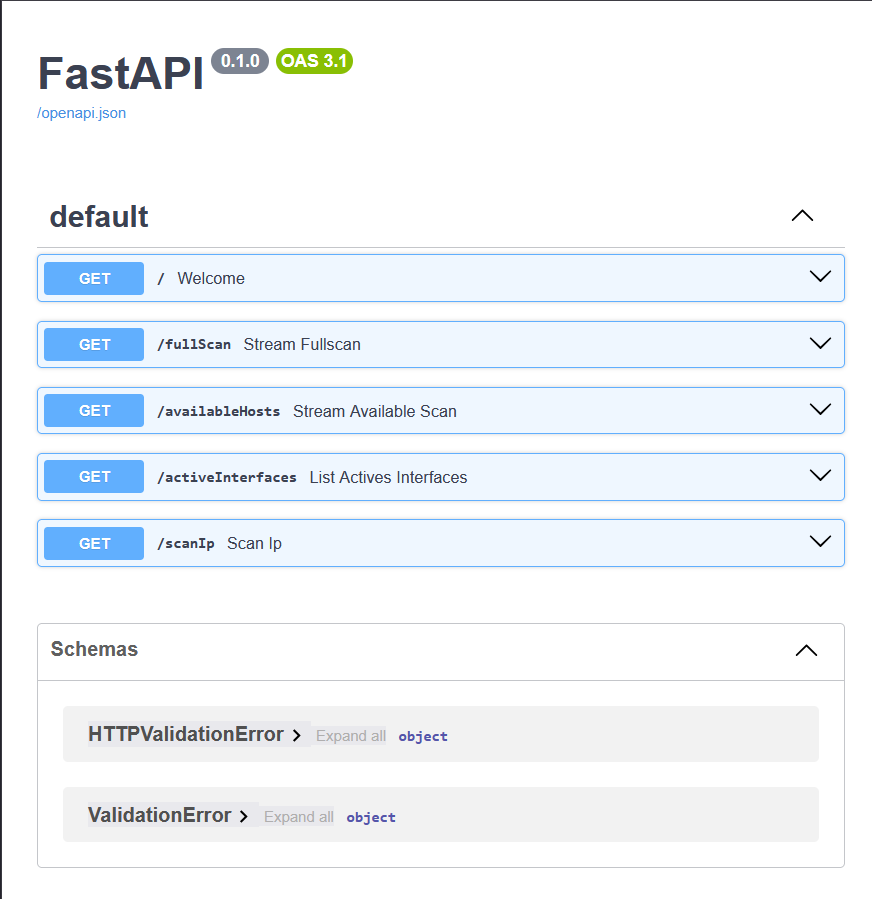

# Network Intelligence API

  
*API endpoints.*

## Overview

A lightweight, modular REST API built with **FastAPI** that provides real‑time network intelligence through asynchronous scanning and discovery. The API enables security professionals and system administrators to quickly map local networks, identify active hosts, and retrieve detailed information about specific IPs using a combination of ARP, ICMP, and Nmap techniques. Designed for extensibility, it serves as a foundational component for larger network monitoring or automation platforms.

## Objectives

- Design a modular, lightweight API for real‑time network intelligence.
- Enable host discovery via **ARP** (local subnet) and **ICMP** (ping sweeps).
- Retrieve detailed port and service information for a target IP using **Nmap**.
- Detect active network interfaces on the local machine.
- Implement asynchronous processing for scalability and performance.
- Provide self‑documenting OpenAPI endpoints.

## Technologies Used

| Tool/Library       | Purpose                                                  |
|--------------------|----------------------------------------------------------|
| **Python 3.11+**   | Core programming language                                |
| **FastAPI**        | Web framework for REST API                               |
| **Scapy**          | ARP scanning and packet manipulation                     |
| **icmplib**        | Asynchronous ICMP ping sweeps                             |
| **python‑nmap**    | Port and service scanning via Nmap                       |
| **socket**         | Hostname and IP resolution                               |
| **psutil**         | Active network interface detection                       |
| **asyncio**        | Concurrency control for multiple scans                   |
| **uvicorn**        | ASGI server for FastAPI                                  |

## Architecture

The API is organized into modular endpoint handlers, each responsible for a specific network operation. Asynchronous tasks are managed with `asyncio.Semaphore` to limit concurrent load.

┌─────────────────┐ ┌─────────────────┐
│ FastAPI App │─────▶│ ARP Scanner │
└─────────────────┘ │ (scapy) │
│ └─────────────────┘
│ ┌─────────────────┐
├──────────────▶│ ICMP Scanner │
│ │ (icmplib) │
│ └─────────────────┘
│ ┌─────────────────┐
├──────────────▶│ Nmap Scanner │
│ │ (python‑nmap) │
│ └─────────────────┘
│ ┌─────────────────┐
└──────────────▶│ Interface Info │
│ (psutil) │
└─────────────────┘
text


All responses are returned in JSON format, making them easy to integrate with front‑end dashboards or other automation tools.

## Setup & Installation

### Prerequisites

- Python 3.11 or higher
- Elevated privileges (for raw socket operations like ARP and Nmap)
- Nmap installed on the system (`sudo apt install nmap` on Linux, or download for Windows)

### Installation

1. Clone the repository:
   ```bash
   git clone https://github.com/yourusername/network-intelligence-api.git
   cd network-intelligence-api
    ```

2. Create and activate a virtual environment:
    ```bash

    python -m venv venv
    source venv/bin/activate   # On Windows: venv\Scripts\activate
    ```

3. Install dependencies:
    ```bash

    pip install -r requirements.txt
    ```

4. Run the API server:
    ```bash

    uvicorn api:app --host 0.0.0.0 --port 8001 --reload
    ```

The API documentation will be available at http://localhost:8001/docs.

### Endpoints
|Method |	Endpoint |	Description|
|---|---|---|
GET	| /interfaces	| List all active network interfaces |
GET	| /arp_scan	| Discover hosts on local subnet using ARP |
GET	| /icmp_scan |	Ping sweep across a range of IPs |
GET	| /nmap_scan/{target}	| Perform a detailed Nmap scan on a specific IP |

All endpoints support query parameters for customization (e.g., timeout, concurrency limits). See the interactive OpenAPI docs for details.

### Example Usage
#### ARP Scan
```bash

curl "http://localhost:8001/arp_scan"
```

Response:
```json

{
  "hosts": ["192.168.1.1", "192.168.1.10", "192.168.1.15"],
  "count": 3
}
```

#### Nmap Scan on a Target
```bash

curl "http://localhost:8001/nmap_scan/192.168.1.10"
```

Response (truncated):
```json

{
  "host": "192.168.1.10",
  "hostname": "printer.local",
  "state": "up",
  "ports": [
    {"port": 80, "state": "open", "service": "http"},
    {"port": 443, "state": "open", "service": "https"}
  ]
}
```

## Performance & Results
  ARP scan on a /24 subnet completes in under 2 seconds.

  ICMP sweep of 256 hosts with concurrency limit 50 finishes in ~5 seconds.

  Nmap scan (default settings) returns detailed port/service data in 10‑30 seconds depending on target responsiveness.

  Memory usage remains below 100 MB under moderate load; CPU usage scales with scan concurrency.

## Lessons Learned
  Asynchronous design significantly improves scan speed without blocking the API.

  Privilege requirements (raw sockets) complicate deployment; future versions may offer optional fallback methods.

  Modular structure simplifies adding new scan types or modifying existing ones.

  Error handling is critical when dealing with unreachable hosts or malformed inputs.

  FastAPI’s auto‑documentation accelerates development and testing.

## Future Improvements
  Add authentication (API keys or OAuth2) for production deployments.

  Store scan results in a database (PostgreSQL, SQLite) for historical analysis.

  Build a frontend dashboard (React/Vue) to visualize scan data.

  Implement scan scheduling and alerting for new devices.

  Package the API as a Docker container for easy distribution.

  Integrate machine learning to detect anomalous network behaviour.

---
Author: Esso Maléki TONINZIBA
